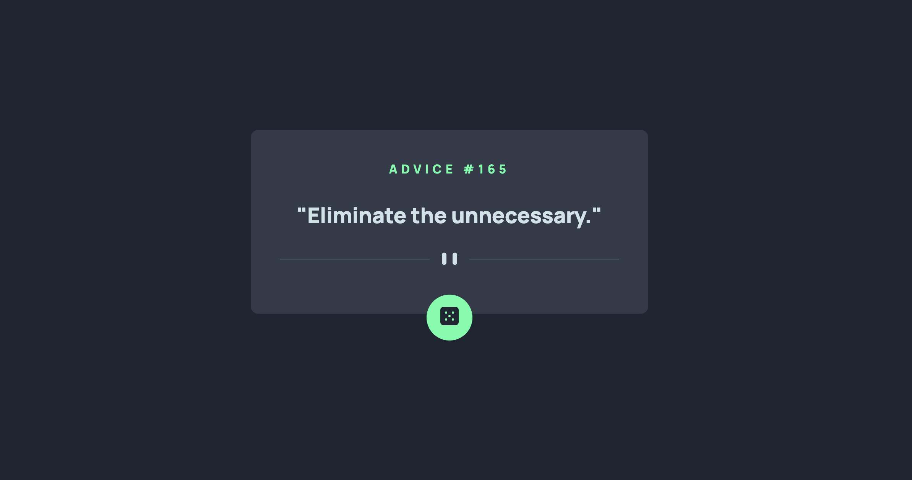

# Frontend Mentor - Advice generator app solution

This is a solution to the [Advice generator app challenge on Frontend Mentor](https://www.frontendmentor.io/challenges/advice-generator-app-QdUG-13db). Frontend Mentor challenges help you improve your coding skills by building realistic projects.

## Table of contents

  - [Screenshot](#screenshot)
  - [Links](#links)
  - [Built with](#built-with)
  - [Author](#author)

### Screenshot

### Links

- Solution URL: [https://github.com/felipestefani/advice-generator](https://github.com/felipestefani/advice-generator)
- Live Site URL: [https://felipestefani.github.io/advice-generator/](https://felipestefani.github.io/advice-generator/)

### Built with

- Semantic HTML5 markup
- CSS custom properties
- Flexbox
- Mobile-first workflow
- API generator - [https://api.adviceslip.com/](https://api.adviceslip.com/) 

## Author

- Linkedin - [Felipe Stefani](https://www.linkedin.com/in/felipe-stefani-a35185116/)
- Frontend Mentor - [@felipestefani](https://www.frontendmentor.io/home)
- Instagram - [@felipestefani_mv](https://www.instagram.com/felipestefani_mv/)
